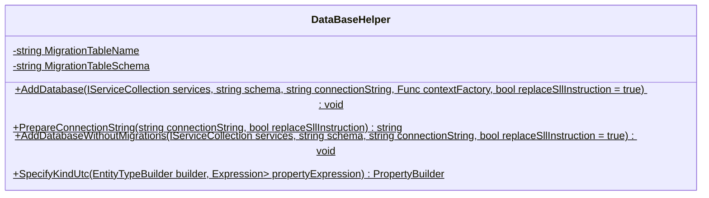
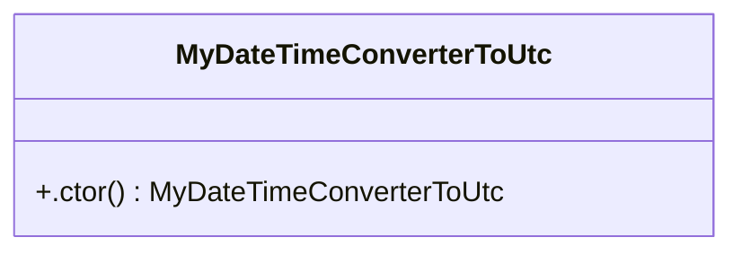
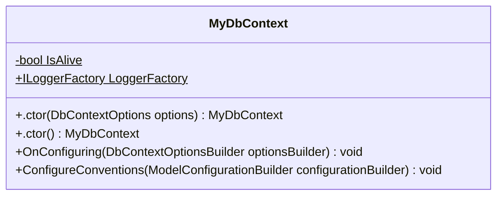

<!-- markdownlint-capture -->
<!-- markdownlint-disable -->

# Code Metrics

This file is dynamically maintained by a bot, *please do not* edit this by hand. It represents various [code metrics](https://aka.ms/dotnet/code-metrics), such as cyclomatic complexity, maintainability index, and so on.

<div id='myjetwallet-sdk-postgres'></div>

## MyJetWallet.Sdk.Postgres :heavy_check_mark:

The *MyJetWallet.Sdk.Postgres.csproj* project file contains:

- 1 namespaces.
- 5 named types.
- 233 total lines of source code.
- Approximately 70 lines of executable code.
- The highest cyclomatic complexity is 6 :heavy_check_mark:.

<details>
<summary>
  <strong id="myjetwallet-sdk-postgres">
    MyJetWallet.Sdk.Postgres :heavy_check_mark:
  </strong>
</summary>
<br>

The `MyJetWallet.Sdk.Postgres` namespace contains 5 named types.

- 5 named types.
- 233 total lines of source code.
- Approximately 70 lines of executable code.
- The highest cyclomatic complexity is 6 :heavy_check_mark:.

<details>
<summary>
  <strong id="databasehelper">
    DataBaseHelper :heavy_check_mark:
  </strong>
</summary>
<br>

- The `DataBaseHelper` contains 6 members.
- 110 total lines of source code.
- Approximately 46 lines of executable code.
- The highest cyclomatic complexity is 6 :heavy_check_mark:.

| Member kind | Line number | Maintainability index | Cyclomatic complexity | Depth of inheritance | Class coupling | Lines of source / executable code |
| :-: | :-: | :-: | :-: | :-: | :-: | :-: |
| Method | <a href='https://github.com/MyJetWallet/MyJetWallet.Sdk.Postgres/blob/master/src/MyJetWallet.Sdk.Postgres/DataBaseHelper.cs#L20' title='void DataBaseHelper.AddDatabase<T>(IServiceCollection services, string schema, string connectionString, Func<DbContextOptions, T> contextFactory, bool replaceSllInstruction = true)'>20</a> | 54 | 1 :heavy_check_mark: | 0 | 6 | 43 / 22 |
| Method | <a href='https://github.com/MyJetWallet/MyJetWallet.Sdk.Postgres/blob/master/src/MyJetWallet.Sdk.Postgres/DataBaseHelper.cs#L85' title='void DataBaseHelper.AddDatabaseWithoutMigrations<T>(IServiceCollection services, string schema, string connectionString, bool replaceSllInstruction = true)'>85</a> | 62 | 1 :heavy_check_mark: | 0 | 3 | 24 / 11 |
| Field | <a href='https://github.com/MyJetWallet/MyJetWallet.Sdk.Postgres/blob/master/src/MyJetWallet.Sdk.Postgres/DataBaseHelper.cs#L17' title='string DataBaseHelper.MigrationTableName'>17</a> | 93 | 0 :heavy_check_mark: | 0 | 0 | 1 / 1 |
| Field | <a href='https://github.com/MyJetWallet/MyJetWallet.Sdk.Postgres/blob/master/src/MyJetWallet.Sdk.Postgres/DataBaseHelper.cs#L18' title='string DataBaseHelper.MigrationTableSchema'>18</a> | 93 | 0 :heavy_check_mark: | 0 | 0 | 1 / 1 |
| Method | <a href='https://github.com/MyJetWallet/MyJetWallet.Sdk.Postgres/blob/master/src/MyJetWallet.Sdk.Postgres/DataBaseHelper.cs#L64' title='string DataBaseHelper.PrepareConnectionString(string connectionString, bool replaceSllInstruction)'>64</a> | 66 | 6 :heavy_check_mark: | 0 | 1 | 20 / 7 |
| Method | <a href='https://github.com/MyJetWallet/MyJetWallet.Sdk.Postgres/blob/master/src/MyJetWallet.Sdk.Postgres/DataBaseHelper.cs#L110' title='PropertyBuilder<DateTime> DataBaseHelper.SpecifyKindUtc<TEntity>(EntityTypeBuilder<TEntity> builder, Expression<Func<TEntity, DateTime>> propertyExpression)'>110</a> | 78 | 1 :heavy_check_mark: | 0 | 6 | 14 / 4 |

<a href="#DataBaseHelper-class-diagram">:link: to `DataBaseHelper` class diagram</a>

<a href="#myjetwallet-sdk-postgres">:top: back to MyJetWallet.Sdk.Postgres</a>

</details>

<details>
<summary>
  <strong id="mydatetimeconvertertoutc">
    MyDateTimeConverterToUtc :heavy_check_mark:
  </strong>
</summary>
<br>

- The `MyDateTimeConverterToUtc` contains 1 members.
- 9 total lines of source code.
- Approximately 2 lines of executable code.
- The highest cyclomatic complexity is 1 :heavy_check_mark:.

| Member kind | Line number | Maintainability index | Cyclomatic complexity | Depth of inheritance | Class coupling | Lines of source / executable code |
| :-: | :-: | :-: | :-: | :-: | :-: | :-: |
| Method | <a href='https://github.com/MyJetWallet/MyJetWallet.Sdk.Postgres/blob/master/src/MyJetWallet.Sdk.Postgres/MyDateTimeConverterToUtc.cs#L9' title='MyDateTimeConverterToUtc.MyDateTimeConverterToUtc()'>9</a> | 91 | 1 :heavy_check_mark: | 0 | 1 | 5 / 2 |

<a href="#MyDateTimeConverterToUtc-class-diagram">:link: to `MyDateTimeConverterToUtc` class diagram</a>

<a href="#myjetwallet-sdk-postgres">:top: back to MyJetWallet.Sdk.Postgres</a>

</details>

<details>
<summary>
  <strong id="mydbcontext">
    MyDbContext :heavy_check_mark:
  </strong>
</summary>
<br>

- The `MyDbContext` contains 6 members.
- 27 total lines of source code.
- Approximately 4 lines of executable code.
- The highest cyclomatic complexity is 2 :heavy_check_mark:.

| Member kind | Line number | Maintainability index | Cyclomatic complexity | Depth of inheritance | Class coupling | Lines of source / executable code |
| :-: | :-: | :-: | :-: | :-: | :-: | :-: |
| Method | <a href='https://github.com/MyJetWallet/MyJetWallet.Sdk.Postgres/blob/master/src/MyJetWallet.Sdk.Postgres/MyDbContext.cs#L13' title='MyDbContext.MyDbContext(DbContextOptions options)'>13</a> | 100 | 1 :heavy_check_mark: | 0 | 2 | 3 / 0 |
| Method | <a href='https://github.com/MyJetWallet/MyJetWallet.Sdk.Postgres/blob/master/src/MyJetWallet.Sdk.Postgres/MyDbContext.cs#L17' title='MyDbContext.MyDbContext()'>17</a> | 100 | 1 :heavy_check_mark: | 0 | 0 | 3 / 0 |
| Method | <a href='https://github.com/MyJetWallet/MyJetWallet.Sdk.Postgres/blob/master/src/MyJetWallet.Sdk.Postgres/MyDbContext.cs#L29' title='void MyDbContext.ConfigureConventions(ModelConfigurationBuilder configurationBuilder)'>29</a> | 100 | 1 :heavy_check_mark: | 0 | 2 | 4 / 1 |
| Field | <a href='https://github.com/MyJetWallet/MyJetWallet.Sdk.Postgres/blob/master/src/MyJetWallet.Sdk.Postgres/MyDbContext.cs#L10' title='bool MyDbContext.IsAlive'>10</a> | 93 | 0 :heavy_check_mark: | 0 | 0 | 1 / 1 |
| Property | <a href='https://github.com/MyJetWallet/MyJetWallet.Sdk.Postgres/blob/master/src/MyJetWallet.Sdk.Postgres/MyDbContext.cs#L11' title='ILoggerFactory MyDbContext.LoggerFactory'>11</a> | 100 | 2 :heavy_check_mark: | 0 | 1 | 1 / 0 |
| Method | <a href='https://github.com/MyJetWallet/MyJetWallet.Sdk.Postgres/blob/master/src/MyJetWallet.Sdk.Postgres/MyDbContext.cs#L21' title='void MyDbContext.OnConfiguring(DbContextOptionsBuilder optionsBuilder)'>21</a> | 85 | 2 :heavy_check_mark: | 0 | 3 | 7 / 2 |

<a href="#MyDbContext-class-diagram">:link: to `MyDbContext` class diagram</a>

<a href="#myjetwallet-sdk-postgres">:top: back to MyJetWallet.Sdk.Postgres</a>

</details>

<details>
<summary>
  <strong id="mydesigntimecontextfactoryt">
    MyDesignTimeContextFactory&lt;T&gt; :heavy_check_mark:
  </strong>
</summary>
<br>

- The `MyDesignTimeContextFactory<T>` contains 3 members.
- 25 total lines of source code.
- Approximately 4 lines of executable code.
- The highest cyclomatic complexity is 1 :heavy_check_mark:.

| Member kind | Line number | Maintainability index | Cyclomatic complexity | Depth of inheritance | Class coupling | Lines of source / executable code |
| :-: | :-: | :-: | :-: | :-: | :-: | :-: |
| Field | <a href='https://github.com/MyJetWallet/MyJetWallet.Sdk.Postgres/blob/master/src/MyJetWallet.Sdk.Postgres/MyDesignTimeContextFactory.cs#L11' title='Func<DbContextOptions, T> MyDesignTimeContextFactory<T>._contextFactory'>11</a> | 100 | 0 :heavy_check_mark: | 0 | 2 | 1 / 0 |
| Method | <a href='https://github.com/MyJetWallet/MyJetWallet.Sdk.Postgres/blob/master/src/MyJetWallet.Sdk.Postgres/MyDesignTimeContextFactory.cs#L13' title='MyDesignTimeContextFactory<T>.MyDesignTimeContextFactory(Func<DbContextOptions, T> contextFactory)'>13</a> | 96 | 1 :heavy_check_mark: | 0 | 2 | 4 / 1 |
| Method | <a href='https://github.com/MyJetWallet/MyJetWallet.Sdk.Postgres/blob/master/src/MyJetWallet.Sdk.Postgres/MyDesignTimeContextFactory.cs#L18' title='T MyDesignTimeContextFactory<T>.CreateDbContext(string[] args)'>18</a> | 84 | 1 :heavy_check_mark: | 0 | 4 | 15 / 3 |

<a href="#MyDesignTimeContextFactory&lt;T&gt;-class-diagram">:link: to `MyDesignTimeContextFactory&lt;T&gt;` class diagram</a>

<a href="#myjetwallet-sdk-postgres">:top: back to MyJetWallet.Sdk.Postgres</a>

</details>

<details>
<summary>
  <strong id="sqllivecheckert">
    SqlLiveChecker&lt;T&gt; :heavy_check_mark:
  </strong>
</summary>
<br>

- The `SqlLiveChecker<T>` contains 7 members.
- 44 total lines of source code.
- Approximately 14 lines of executable code.
- The highest cyclomatic complexity is 2 :heavy_check_mark:.

| Member kind | Line number | Maintainability index | Cyclomatic complexity | Depth of inheritance | Class coupling | Lines of source / executable code |
| :-: | :-: | :-: | :-: | :-: | :-: | :-: |
| Field | <a href='https://github.com/MyJetWallet/MyJetWallet.Sdk.Postgres/blob/master/src/MyJetWallet.Sdk.Postgres/SqlLiveChecker.cs#L16' title='DbContextOptionsBuilder<T> SqlLiveChecker<T>._dbContextOptionsBuilder'>16</a> | 100 | 0 :heavy_check_mark: | 0 | 1 | 1 / 0 |
| Field | <a href='https://github.com/MyJetWallet/MyJetWallet.Sdk.Postgres/blob/master/src/MyJetWallet.Sdk.Postgres/SqlLiveChecker.cs#L14' title='ILogger<SqlLiveChecker<T>> SqlLiveChecker<T>._logger'>14</a> | 100 | 0 :heavy_check_mark: | 0 | 1 | 1 / 0 |
| Field | <a href='https://github.com/MyJetWallet/MyJetWallet.Sdk.Postgres/blob/master/src/MyJetWallet.Sdk.Postgres/SqlLiveChecker.cs#L15' title='MyTaskTimer SqlLiveChecker<T>._timer'>15</a> | 100 | 0 :heavy_check_mark: | 0 | 1 | 1 / 0 |
| Method | <a href='https://github.com/MyJetWallet/MyJetWallet.Sdk.Postgres/blob/master/src/MyJetWallet.Sdk.Postgres/SqlLiveChecker.cs#L18' title='SqlLiveChecker<T>.SqlLiveChecker(ILogger<SqlLiveChecker<T>> logger, DbContextOptionsBuilder<T> dbContextOptionsBuilder)'>18</a> | 75 | 1 :heavy_check_mark: | 0 | 5 | 8 / 4 |
| Method | <a href='https://github.com/MyJetWallet/MyJetWallet.Sdk.Postgres/blob/master/src/MyJetWallet.Sdk.Postgres/SqlLiveChecker.cs#L27' title='Task SqlLiveChecker<T>.DoTime()'>27</a> | 65 | 2 :heavy_check_mark: | 0 | 8 | 18 / 8 |
| Method | <a href='https://github.com/MyJetWallet/MyJetWallet.Sdk.Postgres/blob/master/src/MyJetWallet.Sdk.Postgres/SqlLiveChecker.cs#L46' title='Task SqlLiveChecker<T>.StartAsync(CancellationToken cancellationToken)'>46</a> | 100 | 1 :heavy_check_mark: | 0 | 4 | 4 / 1 |
| Method | <a href='https://github.com/MyJetWallet/MyJetWallet.Sdk.Postgres/blob/master/src/MyJetWallet.Sdk.Postgres/SqlLiveChecker.cs#L51' title='Task SqlLiveChecker<T>.StopAsync(CancellationToken cancellationToken)'>51</a> | 100 | 2 :heavy_check_mark: | 0 | 4 | 4 / 1 |

<a href="#SqlLiveChecker&lt;T&gt;-class-diagram">:link: to `SqlLiveChecker&lt;T&gt;` class diagram</a>

<a href="#myjetwallet-sdk-postgres">:top: back to MyJetWallet.Sdk.Postgres</a>

</details>

</details>

<a href="#myjetwallet-sdk-postgres">:top: back to MyJetWallet.Sdk.Postgres</a>

## Metric definitions

  - **Maintainability index**: Measures ease of code maintenance. Higher values are better.
  - **Cyclomatic complexity**: Measures the number of branches. Lower values are better.
  - **Depth of inheritance**: Measures length of object inheritance hierarchy. Lower values are better.
  - **Class coupling**: Measures the number of classes that are referenced. Lower values are better.
  - **Lines of source code**: Exact number of lines of source code. Lower values are better.
  - **Lines of executable code**: Approximates the lines of executable code. Lower values are better.

## Mermaid class diagrams

<div id="DataBaseHelper-class-diagram"></div>

##### `DataBaseHelper` class diagram



<div id="MyDateTimeConverterToUtc-class-diagram"></div>

##### `MyDateTimeConverterToUtc` class diagram



<div id="MyDbContext-class-diagram"></div>

##### `MyDbContext` class diagram



<div id="MyDesignTimeContextFactory&lt;T&gt;-class-diagram"></div>

##### `MyDesignTimeContextFactory<T>` class diagram

```mermaid
classDiagram
class MyDesignTimeContextFactory<T>{
    -Func<DbContextOptions, T> _contextFactory
    +ignTimeContextFactory(Func<DbContextOptions, T> contextFactory) void
    +CreateDbContext(string[] args) T
}

```

<div id="SqlLiveChecker&lt;T&gt;-class-diagram"></div>

##### `SqlLiveChecker<T>` class diagram

```mermaid
classDiagram
class SqlLiveChecker<T>{
    -ILogger<SqlLiveChecker<T>> _logger
    -MyTaskTimer _timer
    -DbContextOptionsBuilder<T> _dbContextOptionsBuilder
    +veChecker(ILogger<SqlLiveChecker<T>> logger, DbContextOptionsBuilder<T> dbContextOptionsBuilder) void
    +DoTime() Task
    +StartAsync(CancellationToken cancellationToken) Task
    +StopAsync(CancellationToken cancellationToken) Task
}

```

*This file is maintained by a bot.*

<!-- markdownlint-restore -->
